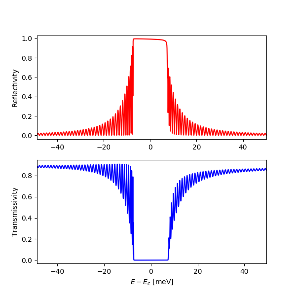
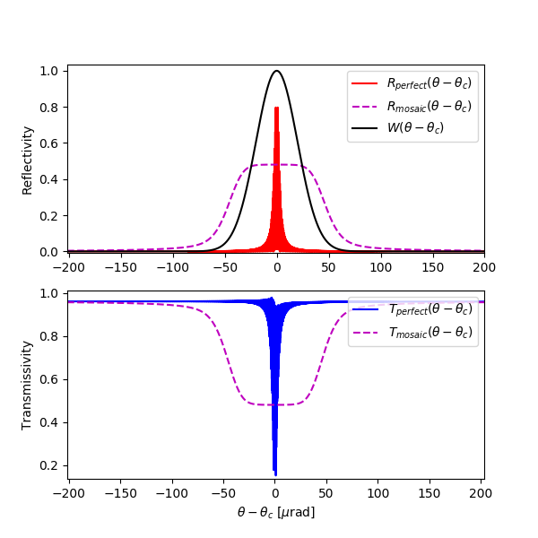

.. _dtxrd:

************
dtxrd
************

x-ray diffraction calculator 
(dynamical theory of x-ray diffraction)

:author: Stanislav Stoupin
:email:  <sstoupin@gmail.com>

SYNOPSIS
============

::

       dtxrd [options] crystal h k l eta phi T d ["a" | "e"] [theta | Ex]

DESCRIPTION
============

Calculates parameters of a given crystal reflection for 
a monochromatic incident wave using dynamical theory of x-ray diffraction for perfect crystals in the 
2-beam approximation

For a brief summary run::

    dtxrd -h

INPUT PARAMETERS
=================

:crystal:
       available crystal models: C (diamond), Si (silicon), Ge (germanium), GaN (wurtzite), SiC-4H, SiC-6H, SiO2 (quartz), Al2O3 (sapphire)

:h k l:  Miller indicies of a chosen reflection

:eta:    asymmetry angle (:math:`\eta` [degrees])

:phi:    azimuthal angle of incidence (:math:`\phi` [degrees])

:T:      crystal temperature [K]

:d:      crystal thickness [mm]

:flag: =====   =================================================================
       flag    description
       =====   =================================================================
       a       perform calculation at a given glancing angle of incidence theta
       e       perform calculation at a given photon energy Ex
       =====   =================================================================

:theta: glancing angle of incidence, theta (:math:`\theta`)

:Ex: photon energy, Ex (:math:`E_{\mathrm X}`)

OPTIONS
============

:-v,      --version:
       show program version

:-h,      --help:
       show summary of options.

:-o FILENAME, --output FILENAME:
       write results to file (default to stdout)

:-w FILENAME, --write FILENAME:
       write data to file (default: no action)

:-p, --pi:
       :math:`\pi` polarization for the incident wave (default: :math:`\sigma` polarization)

:-c CONST, --conv CONST:
       convolve the reflectivity curve with a virtual instrument resolution function with FWHM = CONST [urad], plot the result and 
       and report the resulting width of the convoluted curve

:-s CONST, --syield CONST:
       calculate shape of the secondary yield curve (e.g., photoelectrons) with escape depth CONST [Angstrom] 

:-z STRING, --zblock STRING:
       calculate reflectivity/transmissivity curves for a mosaic crystal (uncorrelated block model) with STRING = 't s', where 
       t is the block thickness [um] and s is the standard deviation of misorientation [urad] (assuming Gaussian distribution)

:-n CONST, --nsteps CONST:
       CONST - number of points in the angular/energy interval (default: 1000)

OUTPUT PARAMETERS
======================

Basic parameters of the chosen h k l reflection: 

:d[A]:     :math:`d` [Angstrom] interplanar distance (d-spacing) of the chosen h k l reflection
       
:Eb[keV]:  :math:`E_B = \frac{hc}{2d}` [keV] Bragg energy

:thr[deg]: :math:`\theta_R` [degrees] incident glancing angle for the exact backscattering
	   (a wave with photon energy :math:`E_R` incident at this angle is reflected exactly backwards)

:Er[keV]:  :math:`E_R` [keV] photon energy for the exact backscattering

:bh:       :math:`b_{H}` asymmetry factor in the chosen scattering geometry 
           for symmetric reflection :math:`\eta = 0` and :math:`b_{H} = - 1`

Susceptibilities and refraction corrections:

:chi_{0}:  :math:`\chi_0` susceptibility 

:chi_{h}:  :math:`\chi_{H}` susceptibility 

:chi_{-h}: :math:`\chi_{\bar{H}}` susceptibility 

:wh(s):    :math:`\omega_{H}^s` refraction correction for symmetric reflection  

:wh:       :math:`\omega_{H} = \omega_{H}^s \frac{b_{H}-1}{2b_{H}}` refraction correction for the chosen reflectoin  

Central energy and angle:

:Ec[keV]:  :math:`E_c` [keV] central energy of the chosen reflection

:thc[deg]: :math:`\theta_c` [deg] central glancing angle of incidence of the chosen reflection 

Energy intrinsic (Darwin) widths (thick non-absorbing crystal) at fixed glancing angle of incidence :math:`\theta_c`:

:eps_s:   :math:`\varepsilon^s` relative energy width of symmetric h k l reflection (same for entrance and exit)
 
:eps:     :math:`\varepsilon` relative entrance energy width of the chosen h k l reflection  

:eps_pr:  :math:`\varepsilon'` relative exit energy width of the chosen h k l reflection 

:Delta_E_s[meV]:   :math:`\Delta E^s` [meV] absolute energy width of symmetric h k l reflection (same for entrance and exit)

:Delta_E[meV]:     :math:`\Delta E` [meV] absolute entrance energy width of the chosen h k l reflection 

:DeltaE_pr[meV]:   :math:`\Delta E'` [meV] absolute exit energy width of symmetric reflection 

Angular intrinsic (Darwin) widths (thick non-absorbing crystal) at fixed photon energy :math:`E_c`:

:dth_s[urad]:      :math:`\Delta \theta^s` [microradian] angular width of the symmetric h k l reflection  (same for entrance and exit)

:dth[urad]:        :math:`\Delta \theta` [microradian] angular entrance width of the chosen h k l reflection  

:dth_pr[urad]:      :math:`\Delta \theta'` [microradian] angular exit width of the chosen h k l reflection 

Additional characteristics of the chosen h k l reflection:

:dE/dth[meV/urad]: :math:`\frac{dE}{d\theta}` [meV/microradian] tangent of the Bragg's Law

:Dr[urad/meV]:     :math:`D_r` [microradian/meV] intrinsic angular dispersion rate of the chosen h k l reflection 

:de[um]:           :math:`d_e` [micrometer] extinction length of the chosen h k l reflection

Reflectivity and Transmissivity:

:Rc[%]:            :math:`R_c` [%] reflectivity at center

:Tc[%]:            :math:`T_c` [%] transmissivity at center

EXAMPLES
===========

A rocking curve of the symmetric Si 111 reflection (Bragg case, 1-mm-thick crystal at 300 K) ::

       dtxrd Si 1 1 1 0 0 300 1 e 8

.. image:: ../../examples/snapshots/Si111_8keV.png
            :width: 70 %
	    :alt: Si111 at 8keV

A rocking curve of the symmetric diamond 220 reflection (Laue case, 0.1-mm-thick crystal plate at 300 K) ::

       dtxrd C 2 2 0 90 0 300 0.1 e 12 

.. image:: ../../examples/snapshots/C220_Laue.png
            :width: 70 %
	    :alt: C220 Laue at 12keV

Reflectivity curve of the diamond 008 reflection in exact backscattering (0.5-mm-thick crystal plate at 300 K).
Accurate sampling of the thickness oscillations is achieved using 10000 points. ::

       dtxrd -n 10000 C 0 0 8 0 0 300 0.5 a 90

Rocking curve of the diamond 220 reflection (0.5-mm-thick crystal plate at 300 K at 20 keV).
Reflectivity/transmissivity of a perfect crystal compared with those of the mosaic crystal with 10 um block size
having misorientation of 20 microradian r.m.s. (uncorrelated block model) ::

       dtxrd -n 10000 -z '10 20' C 2 2 0 90 0 300 0.5 e 20

Note: reflectivity for a mosaic crystal in backscattering has not been implemented yet 

SEE ALSO
============

* :ref:`throughput`
* :ref:`rcpeak`

:author: Stanislav Stoupin
:email:  <sstoupin@gmail.com>
:date: |today|
