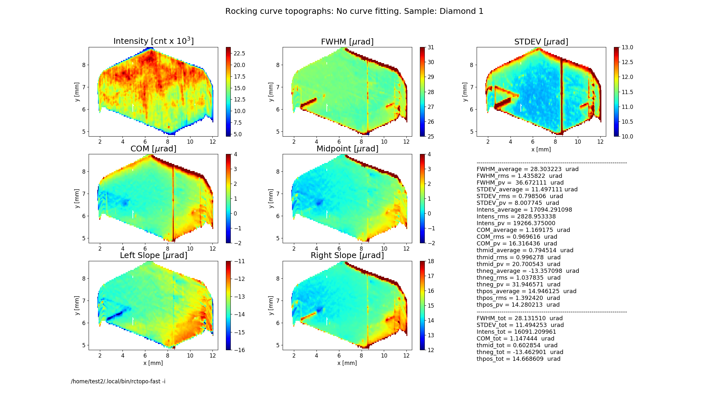
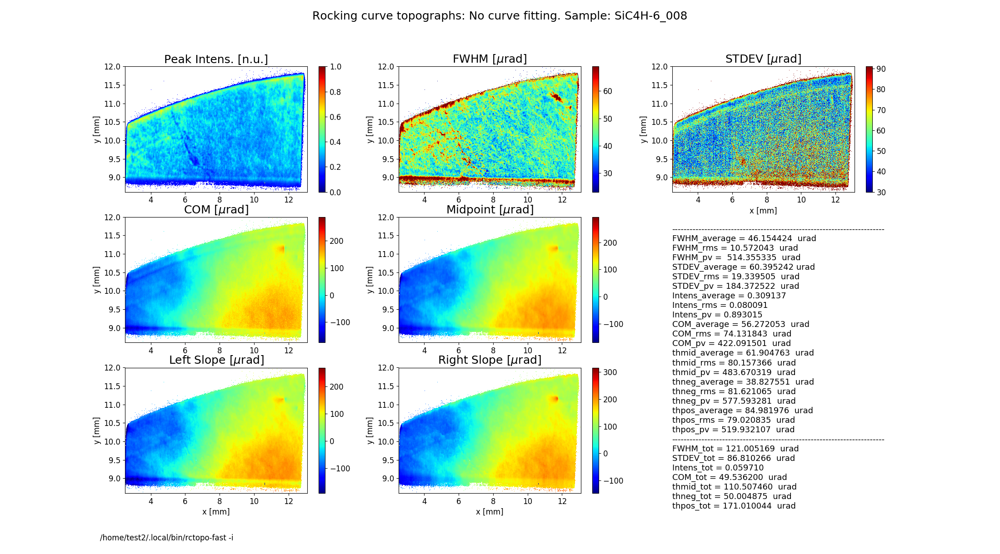

.. _rctopo-fast:

************
rctopo-fast
************

:author: Stanislav Stoupin
:email:  <sstoupin@gmail.com>

accelerated x-ray rocking curve topography calculator

SYNOPSIS
============

::

       rctopo-fast [options] filename1 filename2 ... filenameN

DESCRIPTION
============

A program to process a sequence of images (topographs) collected at different angles on the 
rocking curve of a crystal to generate maps of the rocking curve parameters.
Supported area detector file formats: HDF4 (.hdf), HDF5 (.h5), a variety of image formats (PNG, TIFF, JPG).
rctopo-fast is a substantially modified, vectorized version of rctopo code yielding improved computation speed. 
The vectorized procedure of finding the curve parameters using half-maximum level crossing is supplemented by  
curve fitting. The fitting procedure is based on pixel-by-pixel algorighm (similar to rctopo), 
yet taking advantage of multiple processor cores (see --nproc option, where the default number of cores is 4). 

OPTIONS
============

For a brief summary run::

    rctopo -h

:-h,        --help:
       show summary of options

:-v,        --version:
       show program's version

:-o FILENAME, --output FILENAME:
       write calculated results to file (default to stdout); also, generates output prcurve.dat and trcurve.dat
       containing the rocking curve from the central pixel and the total rocking curve respectively 

:-w FILENAME, --output FILENAME:
       write slice data to file (default: no action)

:--hdf5 FILENAME:
       save data and topographs to hdf5 file (default: no action)

:-j,       --tif:  
       save calculalted rocking curve topographs as tif files (default: no action)
    
:-t CONST, --threshold CONST:
       threshold CONST for data processing to define crystal boundaries (default T=1.05)

:-b CONST, --background CONST:
       user defined background CONST, e.g., dark current of the area detector (default: value is estimated
       from the rocking curve tails)

:-r STRING, --range STRING:
       xy-range for display and analysis (STRING='x1 x2 y1 y2', where x1,x2,y1,y2 are in units of
       [mm])

:-x CONST, --xslice CONST:
       plot distributions (slices) at a fixed coordinate X = CONST

:-y CONST, --yslice CONST:
       plot distributions (slices) at a fixed coordinate Y = CONST

:-f CONST, --factor CONST:
       scale colormap range on FWHM and STDEV topographs by CONST*FWHM_av, where FWHM_av is the average FWHM

:-m CONST, --magnify CONST:
       scale colormap range for COM, Midpoint, Left Slope and Right Slope by factor CONST*FWHM_av, where FWHM_av is the average FWHM

:-n STRING, --name STRING:
       include sample name STRING in the figure title

:-d CONST, --deglitch CONST:
       deglitch data using median filtering, where CONST (an odd number, e.g., CONST=3) is the size of the filter window (default: no deglitching)

:--stat       flag:
       perform curve fitting using flag g for Gaussian, l for Lorentzian

:--nproc     CONST:
       number of processor cores for fitting (default: CONST = 4)

:-s,   --transpose:
       transpose image array for plotting

:-u uname, --units uname:
       assign the original angular units (uname): deg, arcsec or urad (default: deg)

:-p,      --publish:
       generate additional figures (requires user-defined figures.py script)

:-c,      --conduct:
       process sequence of diffraction images collected in transmission mode

:-i,      --instrument:      
       read parameters from configuration file ccd.py

:-z CONST, --integrate CONST:
       presentation of the intensity (reflectivity) map:

       CONST = 0  plot peak intensity normalized by the found maximum value (default)

       CONST = -1 plot integrated intensity normalized by the found maximum value 

       otherwise (CONST !=0 and CONST !=-1) plot raw intensity counts normalized by input parameter CONST (e.g., CONST = 1)

:-e FILENAME, --external=FILENAME:
	read angular steps from the first column of a text (ASCII) file (e.g., SPEC scan) 

:--diag:
       show diagnostic messages

GRAPHICAL OUTPUT
====================
By default the program generates two figures.

**Figure 1** shows the rocking curve of the central pixel in the analyzed region, a Gaussian and Lorentzian fits 
to this curve and the total rocking curve for comparison.

**Figure 2** shows topographs of the following rocking curve parameters.

**Intensity** (normalized peak intensity (default))

**FWHM** (curve width calculated as full width at half maximum)

**STDEV** (standard deviation of the intensity around the mean value or the second moment of the intensity-angular distribution)

**COM** (rocking curve peak position calculated as center of mass or the first moment of the intensity-angular distribution)

**Midpoint** (peak position as average of the left and the right slope positions)

**Left Slope** (peak position of the left slope of the curve)

**Right Slope** (peak position as the right slope of the curve)

**Figure 2** also displays statistical characteristics calculated across the entire 2D region as seen on the topographs.
These characteristics are the average (mean) value, the standard deviation and the peak-to-valley variation. 
In addition, statistics of the total rocking curve (curve averaged across the region) are displayed below.

EXAMPLES/TUTORIALS
======================

I. Rocking curve topography using HDF5 images and a configuration file
****************************************************************************************
The archive below contains a sequence of images embedded into h5 files (one file per image) 
of a diamond 111 crystal plate. The source was a bending magnet synchrotron beamline 
with a double-crystal Si (111) monochromator tuned to a photon energy of 8.05 keV. 
A strongly asymmetric Si (220) collimating crystal was used.
The original images collected using area detector PIXIS 1024F 
(pixel size of 13x13 um^2) were 4x4 binned to save space:

:download:`C111-1_4x4_rctopo.zip <../../examples/rctopo/C111-1_h5/C111-1_4x4_rctopo.zip>`

The input parameters are declated in the configuration file below. It should be placed 
in the working folder, which contains the images (the original ccd.py in the archive has
to be replaced with the one below).

:download:`ccd.py <../../examples/rctopo/C111-1_h5f/ccd.py>`

To process the seqence of images using the configuration file (**-i** option)::

    rctopo-fast -i C111*.h5

Note, that the instrument file includes all other parameters, which are necessary to perform data analysis.

            **Figure 1** Rocking curves

            **Figure 2** Rocking curve topographs

Options can be also specified in the command line. In this case the parameters assigned through option will
supercede the corresponding parameters declared in the configuration file ccd.py.
For example, Lorentzian fitting can be performed::

    rctopo-fast --stat l -i C111*.h5

Note, that the option **--stat l** supercedes the instruction **stat = None** in the configuration file ccd.py. 

            **Figure 2** Rocking curve topographs
As Figure 1 of this example suggests neither Lorentzian nor Gaussian is a good approximation to the shape of the
diamond rocking curve (in this case fitting to Lorentzian shape is only for illustrative purposes). 
For example, the last run of the program with **--stat l** option yields artificially smaller values for FWHM.  

II. Analysis of a large dataset using an angular scale provided by an external file
****************************************************************************************
In this example a large dataset from the 0008 reflection of 
a section of SiC-4H wafer is processed. The sequence of images was collected using 
ANDOR-NEO detector with a pixel size of 6.5x6.5 um^2, 
(1x objective lens, indirect detection of x-rays using visible light from a scintillator). 
Due to the size of the dataset (860 MB) it is not distributed with the program. 
The dataset can be made available on request from the authors.  

As in the previous example all required parameters are declared in the configuration file.

:download:`ccd.py <../../examples/rctopo/SiC-4H/ccd.py>`

Note, that the card **fn_ang = '5.dat'** specifies the external ASCII file (SPEC scan), which contains the angular 
coordinate (rocking angle) in its first column. 

:download:`5.dat <../../examples/rctopo/SiC-4H/5.dat>`

To execute the program run::

    rctopo-fast -i *.tiff

If the card **fn_ang = '5.dat'** is not declared in the configuration file 
the assignment can be done in the command line through **-e** option::

   rctopo-fast -e 5.dat -i *.tiff

            **Figure 1** Rocking curves

            **Figure 2** Rocking curve topographs

SEE ALSO
============

* :ref:`rctopo`
* :ref:`seehdf`
* :ref:`rcpeak`

:author: Stanislav Stoupin
:email:  <sstoupin@gmail.com>
:date: |today|
