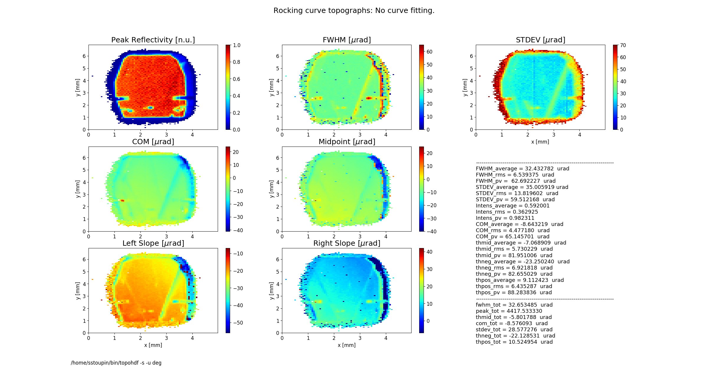
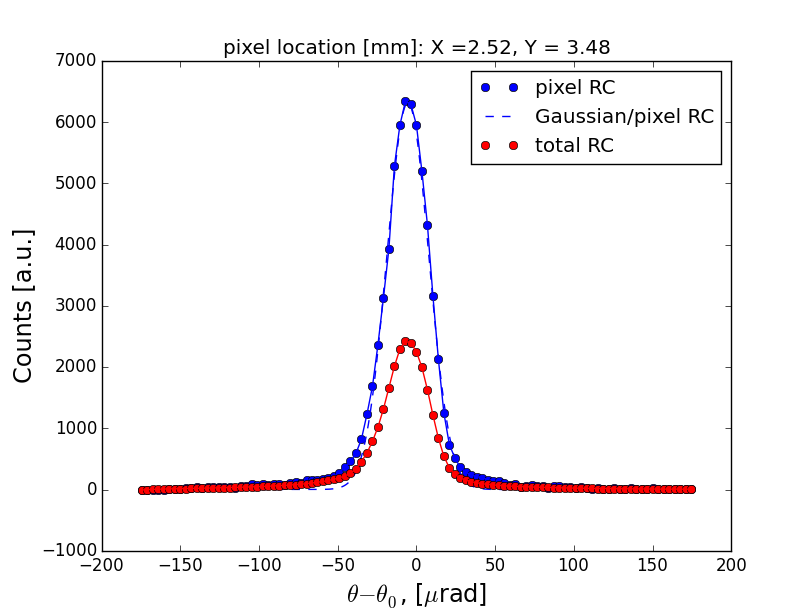
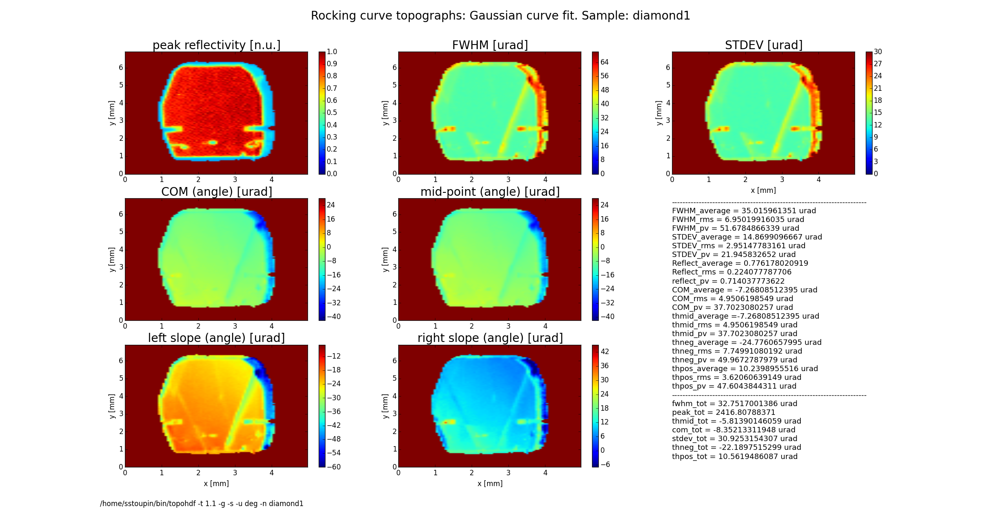
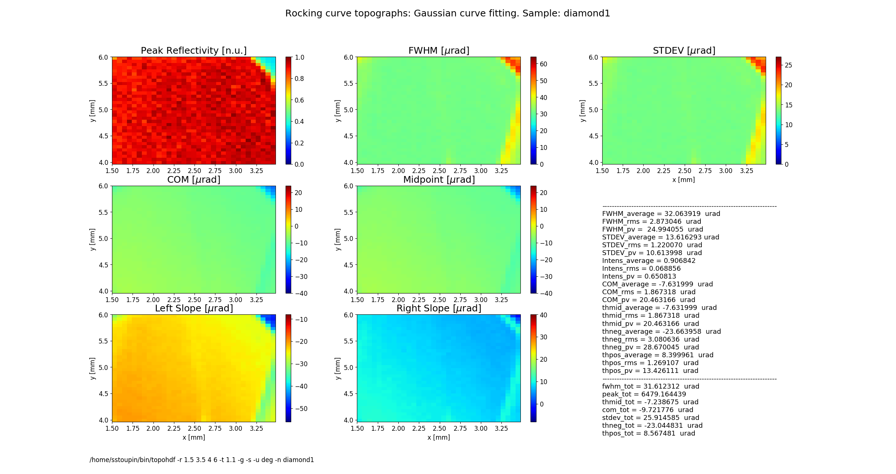
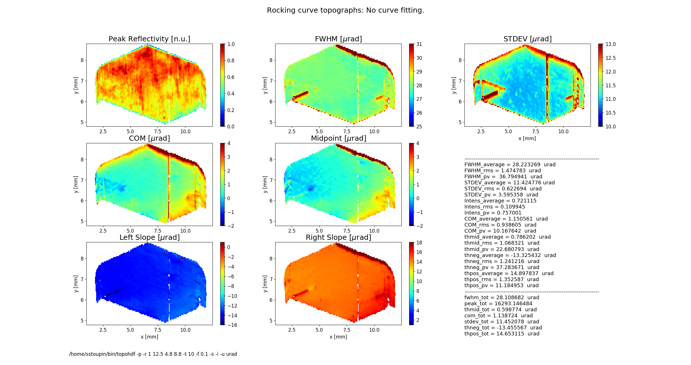
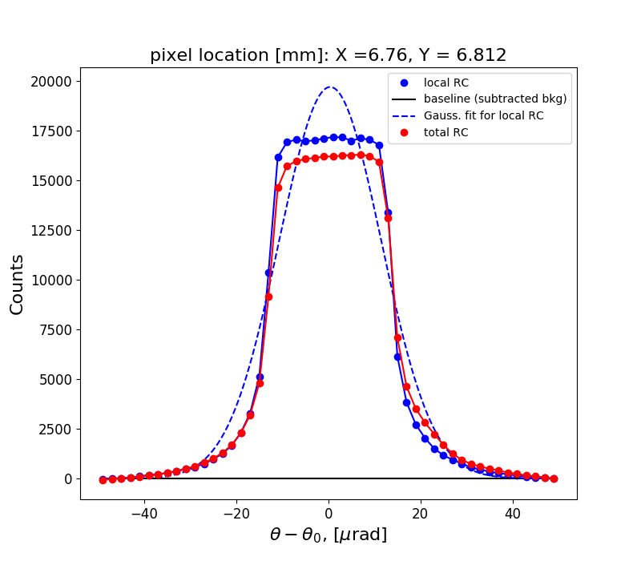
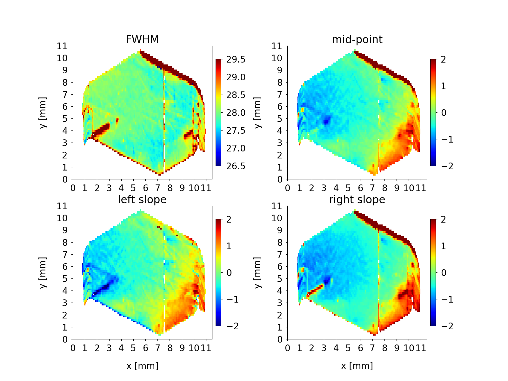
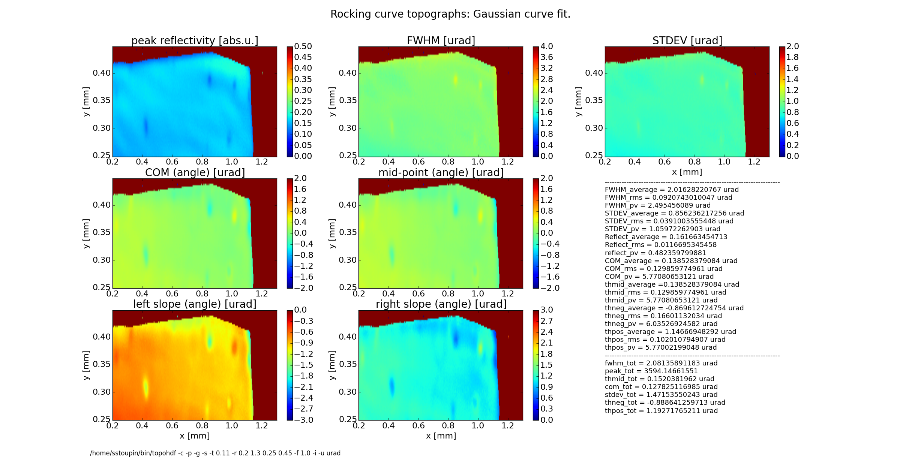
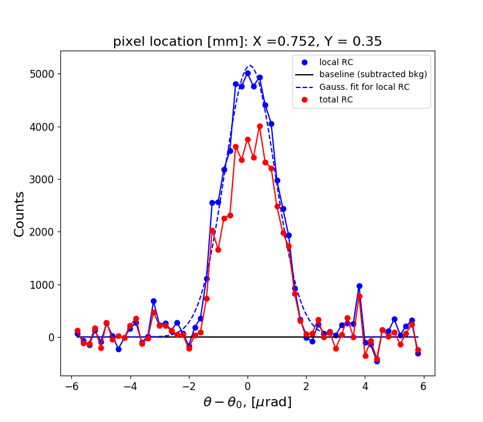
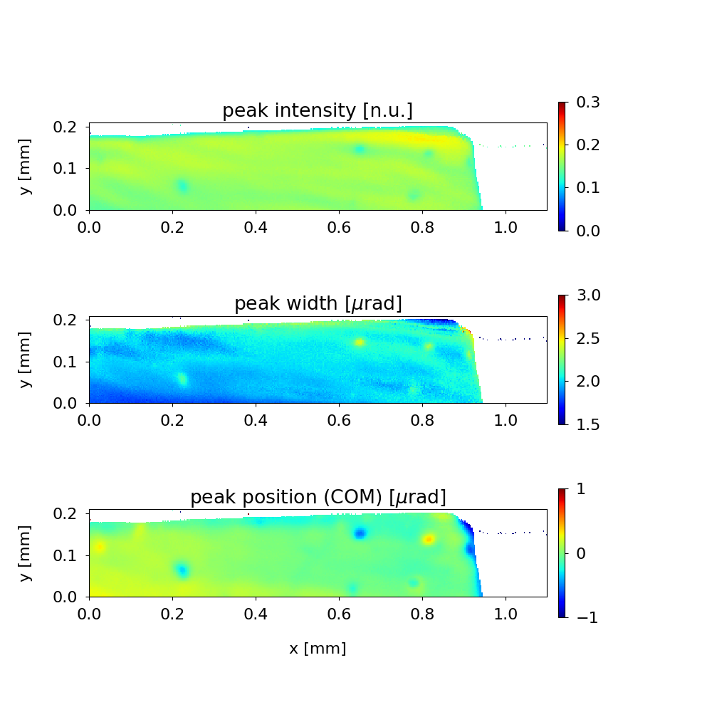

.. _rctopo:

************
rctopo
************

:author: Stanislav Stoupin
:email:  <sstoupin@gmail.com>

x-ray rocking curve topography program 

SYNOPSIS
============

::

       rctopo [options] filename1 filename2 ... filenameN

DESCRIPTION
============

A program to process a sequence of topographs collected at different angles on the 
rocking curve of a crystal to generate maps of the rocking curve parameters.
Supported area detector file formats: HDF4 (.hdf), HDF5 (.h5), a variety of image formats (PNG, TIFF, JPG)

OPTIONS
============

For a brief summary run::

    rctopo -h

:-v,   --version:
       show program's version

:-h,         --help:
       show summary of options

:-o F, --output=F:
       write calculated results to file F (default to stdout); also, generates output 1pix_total.dat
       showing the rocking curve from the central pixel and the total rocking curve

:-w D, --output=D:
       write slice data to file D (default: do not write)

:-t T, --threshold=T:
       threshold for data processing to reject "weak" rocking curves to define
       crystal boundaries (default T=1.05)

:-b bkg, --background=bkg:
       user defined background (dark current) of the area detector (default value is estimated
       from the rocking curve tails)

:-r STRING, --range=STRING:
       xy-range for display and analysis (STRING='x1 x2 y1 y2', where x1,x2,y1,y2 are in units of
       [mm])

:-x CONST, --xslice=CONST:
       slice and plot distributions at a fixed coordinate X = CONST

:-y CONST, --yslice=CONST:
       slice and plot distributions at a fixed coordinate Y = CONST

:-f CONST, --factor=CONST:
       scale colormap range on topographs by CONST*FWHM_av, where FWHM_av is the average FWHM

:-m CONST, --magnify=CONST:
       shrink range on the colormaps by factor CONST; applies only to the colormaps which 
       represent characteristic width of the rocking curve width (FWHM and STDEV)

:-n STRING, --name=STRING:
       include sample name STRING in the figure title

:-d CONST, --deglitch=CONST:
       deglitch rocking curve data with CONST as a threshold parameter (e.g., CONST=1.1) (default - no deglitching)

:-g,   --gaussian:
       perform Gaussian curve fitting (smoothes noisy images)

:-s,   --transpose:
       transpose image array for plotting

:-u uname, --units=uname:
       assign the original angular units (uname): deg, arcsec or urad (default - deg)

:-p,   --publish:
       generate additional figures with publication quality (requires a separate figures.py script)

:-c,   --conduct:
       process forward diffraction data       

:-i,   --instrument:      
       read the detector and the image analysis parameters from an instrument file ccd.py

:-z CONST, --integrate=CONST:
       integrate reflectivity and normalize by the theoretical angular acceptance for perfect crystal (CONST);
       specific cases: z = 0 - no integration (default), z = -1 - integrate and normalize by the maximum value 

:-e SPECSCAN, --external=SPECSCAN:
	read angular steps from the first column of a SPEC scan 

GRAPHICAL OUTPUT
===========
By default the program generates two figures. **Figure 1** shows several topographs of the following rocking curve parameters.

**reflectivity** (normalized peak reflectivity by default)

**FWHM** (curve width calculated as full width at half maximum)

**COM** (rocking curve peak position calculated as center of mass or the first moment of the intensity-angular distribution)

**left slope** (peak position of the left slope of the curve)

**right slope** (peak position of the right slope of the curve)

**mid-point** (peak position as average of the left and the right slope positions)

**STDEV** (standard deviation of the intensity around the mean value or the second moment of the intensity-angular distribution)

**Figure 1** also displays simple statistical parameters calculated across the entire 2D region as seen on the topographs.
These parameters correspond to the mean value, standard deviation and the peak-to-valley variation. 
In addition, parameters of the total rocking curve (averaged across the region) are displayed below. 

**Figure 2** shows the rocking curve of the central pixel in the analyzed region, a Gaussian fit to this curve and the total rocking curve for comparison.

EXAMPLES/TUTORIALS
===========

I. Sequential topography using HDF4 images
****************************************************************************************

This archive below contains a set of hdf images of a diamond 111 crystal plate (one image per file) 
collected at different angles on the rocking curve 
In this example a Cu :math:`K_{\alpha}` rotating anode x-ray source was used. 
The beam was collimated using a strongly asymmetric Si 220 reflection. 

:download:`SA1.zip <../../examples/rctopo/SA1.zip>`

to perform quick evaluation::

    rctopo -s -u deg *hdf

            **Fig. 1** Rocking curve topographs

            **Fig. 2** Rocking curves	   	    

to better define crystal boundary (threshold for analysis), to obtain a smooth image (Gaussian fitting for each pixel), and to display the name of the sample in the figure title::

    rctopo -t 1.1 -g -s -u deg -n diamond1 *hdf

            **Fig. 1** Rocking curve topographs

to select a region (the program assumes mm) and to perform statistical analysis and visualization over this region::

    rctopo -r '1.5 3.5 4 6' -t 1.1 -g -s -u deg -n diamond1 *hdf

            **Fig. 1** Rocking curve topographs

.. figure:: ../../examples/snapshots/1pix-rctopo_hdf2.png
            :width: 50 %
            :align: center
	    :alt: diamond SA1 working region	    	    
            :figclass: align-center 	  

            **Fig. 2** Rocking curves

II. Sequential topography using HDF5 images and an instrument file
****************************************************************************************
The archive below contains a sequence of images embedded into h5 files (one file per image) 
of a diamond 111 crystal plate. The source was a bending magnet synchrotron beamline 
with a double-crystal Si (111) monochromator tuned to a photon energy of 8.05 keV. 
A strongly asymmetric Si (220) collimating crystal was used.

:download:`C111-1.zip <../../examples/rctopo/C111-1_h5/C111-1.zip>`

The area detector PIXIS 1024F has a pixel size of 13x13 um^2. 
These parameters are described in the instrument file below.

:download:`ccd.py <../../examples/rctopo/C111-1_h5/ccd.py>`

Note, that the instrument file includes paths within the h5 file 
for the image array, theta and chi angles.
To perform faster data processing rebinning is enabled using the rebinning factor **rbin=4**. 
Parameters **tot_range** and **dyn_range** define the upper limit of the dynamic range 
(a factor to the background level **bkg0**). These can be used to reject "hot" pixels.

To process the seqence of images using the instrument file (**-i** option)::

    rctopo -p -r '1 12.5 4.8 8.8' -t 20 -f 0.1 -s -i -u urad

            **Fig. 1** Rocking curve topographs

            **Fig. 2** Rocking curves

Here, option **-p** calls for a script (placed along with ccd.py in the current data folder):

:download:`figures.py <../../examples/rctopo/C111-1_h5/figures.py>`

where an additional figure is generated having customized axes, titles, subplots, etc. This custom script written using matplotlib commands and parameters in principle can yield a publication-quality figure.

            **Fig. 3** Rocking curve topographs (selected and customized)

III. Sequential topography of forward diffraction data
****************************************************************************************
The archive of data below represents a set of forward diffraction topographs of 
of a diamond (13 13 3) reflection in backscattering using a narrow bandwidth (1 meV) monochromatic x-rays.
Instead of the Bragg angle of the crystal the photon energy of the incident x-ray beam (here in units of microradian) is scanned with small incremental steps. 

:download:`C_TC.zip <../../examples/rctopo/C_TC_h5/C_TC.zip>`

The forward diffraction data are processed using an option **-c**. In this mode the normal transmission level is
subtracted by the data, the resulting difference is then inverted and treated as a reflectivity curve.
The data rejection threshold in this mode is specified in the ccd.py file with the parameter **bkg0**.

:download:`ccd.py <../../examples/rctopo/C_TC_h5/ccd.py>`

To process these data the rejection threshold represents the fraction of the normal transmission level and should be always less than 1.0 (**-t 0.11** in this case)::

    rctopo -c -p -g -s -t 0.11 -r '0.2 1.3 0.25 0.45' -f 1.0 -i -u urad *h5

            **Fig. 1** Forward diffraction topographs

            **Fig. 2** Forward diffraction curves

            **Fig. 3** Forward diffraction topographs (selected and customized)

SEE ALSO
============

* :ref:`seehdf`
* :ref:`rcpeak`

:author: Stanislav Stoupin
:email:  <sstoupin@gmail.com>
:date: |today|
