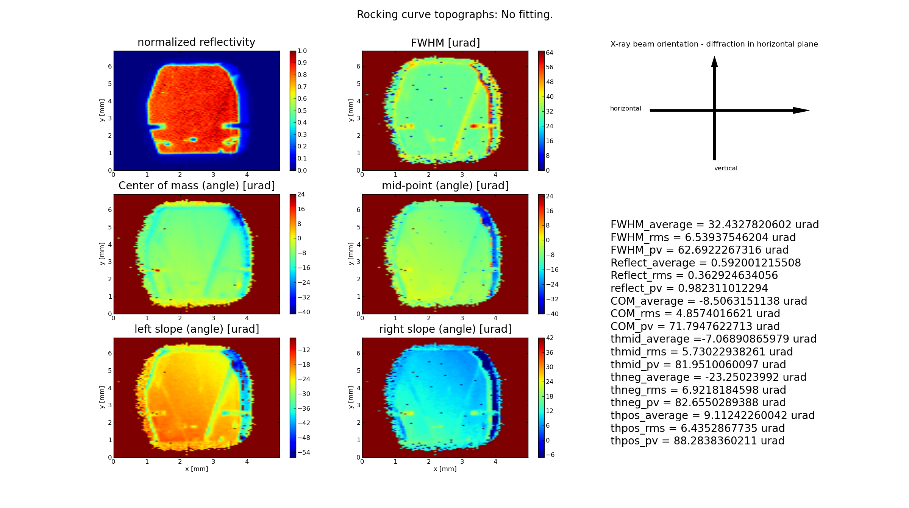
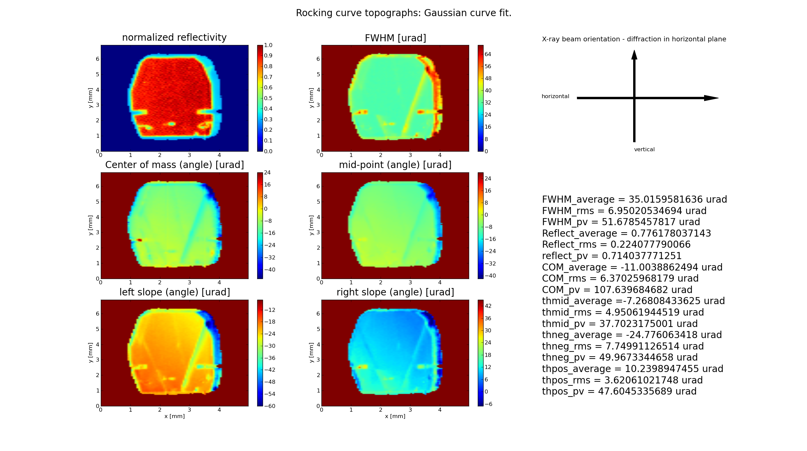
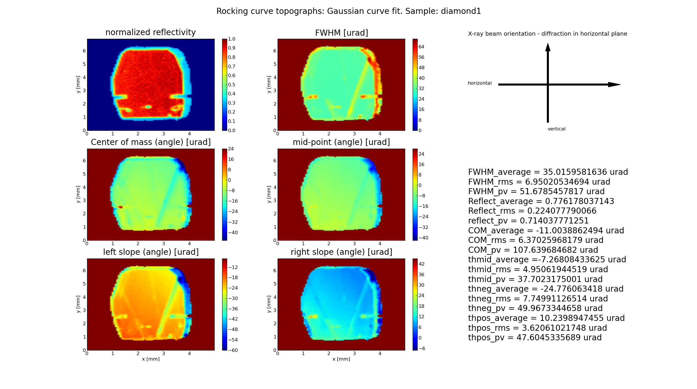
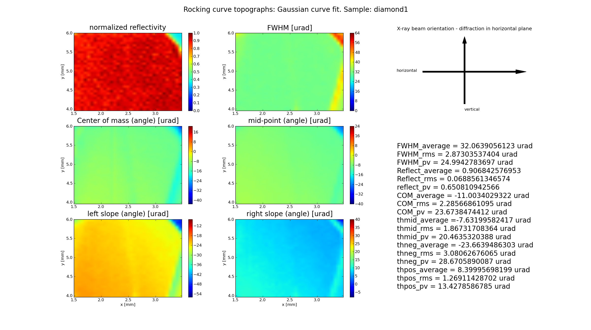

.. _rctopo:

************
rctopo
************

:author: Stanislav Stoupin
:email:  <sstoupin@gmail.com>

x-ray rocking curve image calculator (for a series of hdf4 CCD snapshots)

SYNOPSIS
============

::

       rctopo [options] filename1.hdf filename2.hdf ... filenameN.hdf

DESCRIPTION
============

A program to process a series of images generated by a CCD camera (hdf4 files) to
generate rocking curve images (x-ray diffraction topographs)

OPTIONS
============

For a brief summary run::

    rctopo -h

:-v, --version:
       show version of program.

:-h, --help:
       show summary of options.

:-o F, --output=F:
       write results to file F (default to stdout)

:-t T, --threshold=T:
       threshold for data processing to reject "weak" rocking curves to define
       crystal boundaries (default T=1.05)

:-b bkg, --background=bkg:
       user defined background (dark current) of a CCD (default value is estimated
       by rocking curve tails)

:-r STRING, --range=STRING:
       xy-range  for display and statistical processing (STRING='x1 x2 y1 y2' where x1,x2,y1,y2 are in units of
       [mm])

:-f CONST, --factor=CONST:
       scale colormap range on topographs by CONST*FWHM_av, where FWHM_av is the average FWHM

:-d CONST, --deglitch=CONST:
       deglitch rocking curve data with CONST parameter (e.g., CONST=1.1) (default - no deglitching)

:-g, --gaussian:
       do Gaussian curve fitting (smooth images for noisy data)

:-s, --transpose:
       transpose image matrix for plotting

:-u uname, --units=uname:
       angular units in hdf4 file: uname=deg, arcsec or urad (default - deg)

:-p, --publish:
       generate additional figures with publication quality (requires a separate publish.py script)

EXAMPLES
===========

This archive contains a set of hdf images of a diamond 111 crystal collected at 
different angles on its rocking curve using a Cu :math:`K_{\alpha}` radiation collimated by a 
strongly asymmetric Si 220 reflection. 

:download:`SA1.zip <../../examples/rctopo/SA1.zip>`

to perform quick evaluation run::

    rctopo -s -u deg *hdf

to better define crystal boundary (threshold for analysis) and to obtain a smooth image (Gaussian fitting for each pixel) run::

    rctopo -t 1.1 -g -s -u deg *hdf

to display the name of the sample in the figure title run::

    rctopo -t 1.1 -g -s -u deg -n diamond1 *hdf

to perform statistical analysis and visualization over a specified region run::

    rctopo -r '1.5 3.5 4 6' -t 1.1 -g -s -u deg -n diamond1 *hdf

SEE ALSO
============

* :ref:`seehdf`
* :ref:`rcpeak`

:author: Stanislav Stoupin
:email:  <sstoupin@gmail.com>
:date: |today|
