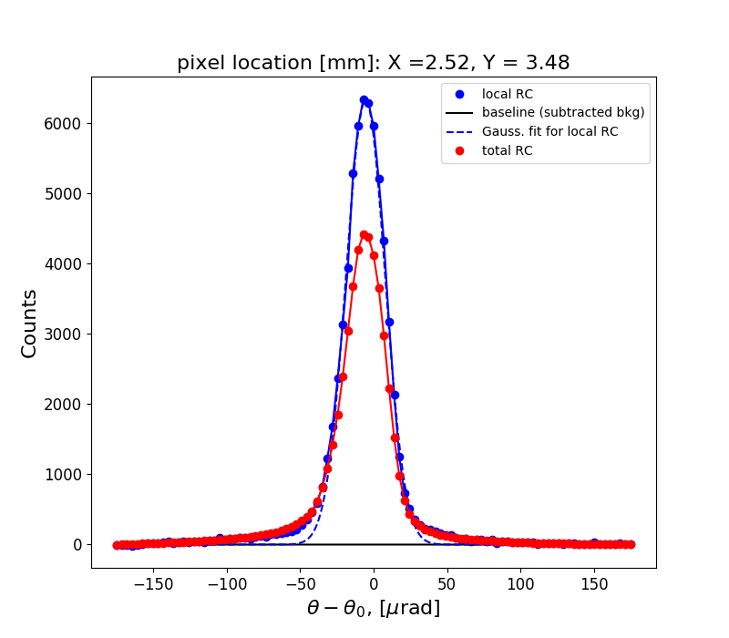
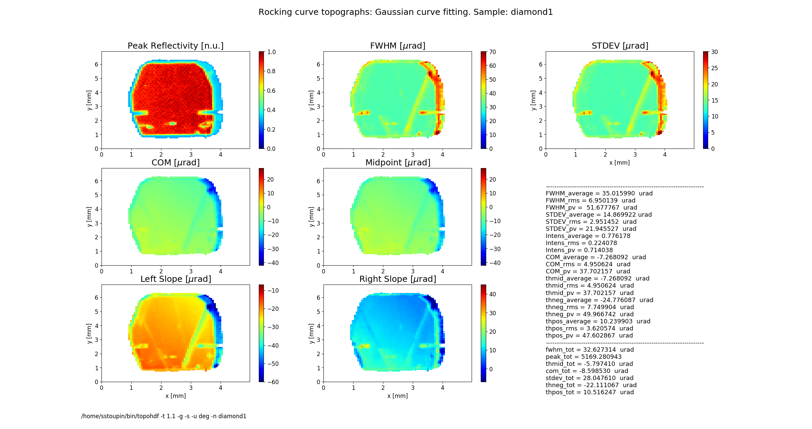
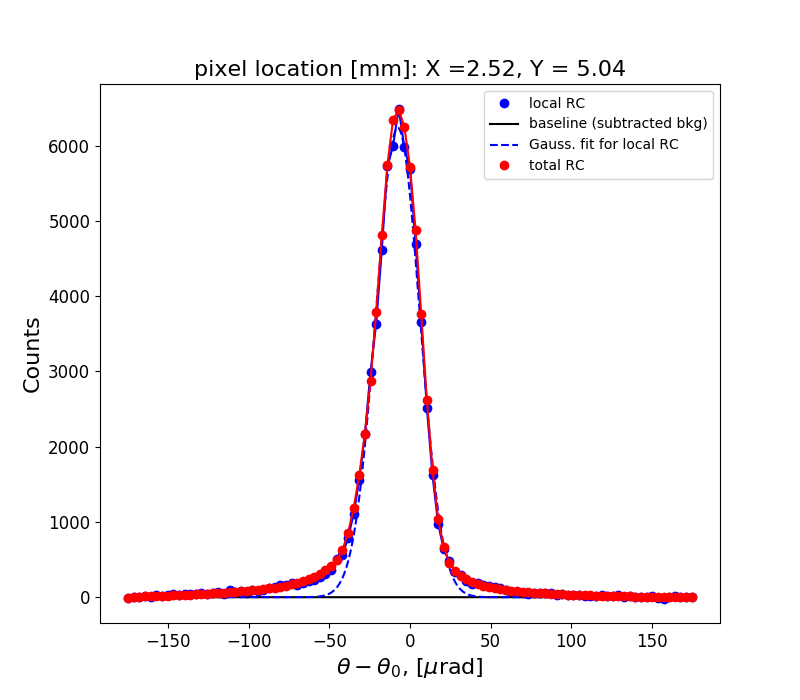
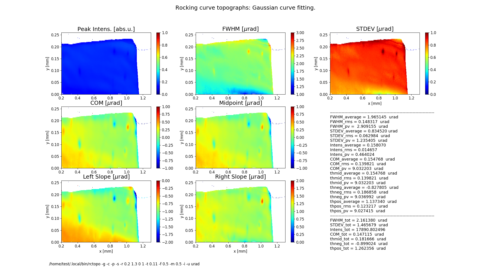
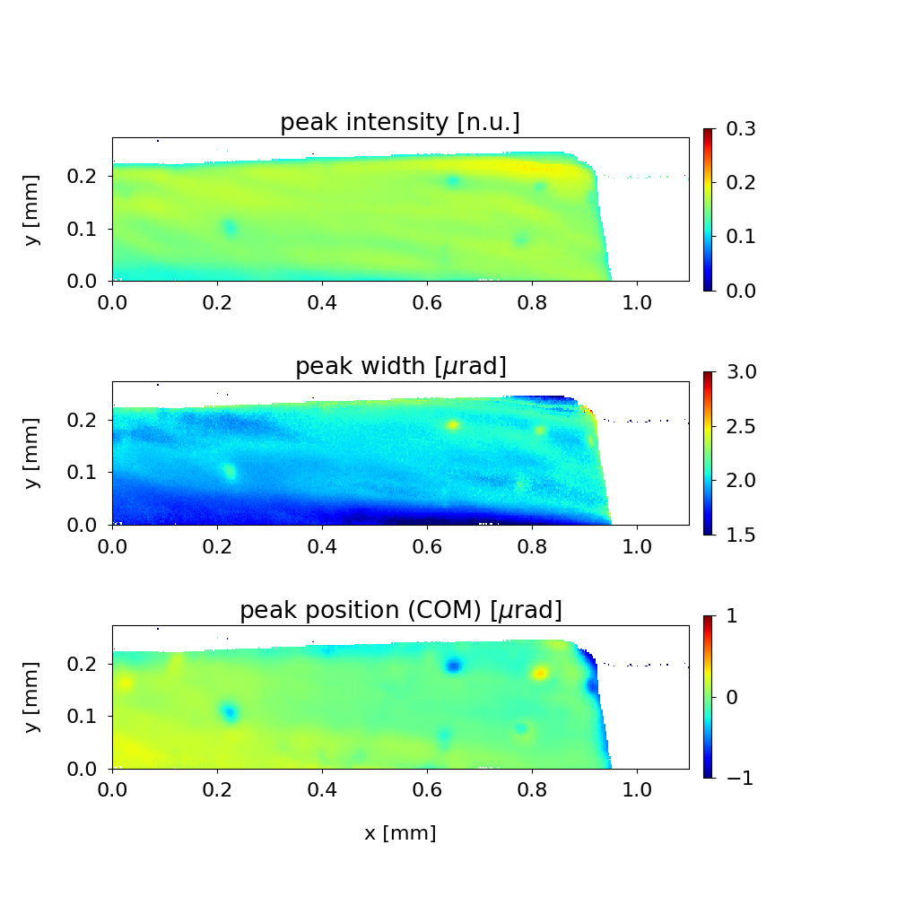

.. _rctopo:

************
rctopo
************

:author: Stanislav Stoupin
:email:  <sstoupin@gmail.com>

x-ray rocking curve topography calculator

SYNOPSIS
============

::

       rctopo [options] filename1 filename2 ... filenameN

DESCRIPTION
============

A program to process a sequence of images (topographs) collected at different angles on the 
rocking curve of a crystal to generate maps of the rocking curve parameters.
Supported area detector file formats: HDF4 (.hdf), HDF5 (.h5), a variety of image formats (PNG, TIFF, JPG)

OPTIONS
============

For a brief summary run::

    rctopo -h

:-h,        --help:
       show summary of options

:-v,        --version:
       show program's version

:-o FILENAME, --output FILENAME:
       write calculated results to file (default to stdout); also, generates output prcurve.dat and trcurve.dat
       containing the rocking curve from the central pixel and the total rocking curve respectively 

:-w FILENAME, --output FILENAME:
       write slice data to file (default: no action)

:--hdf5 FILENAME:
       save data and topographs to hdf5 file (default: no action)

:-j,       --tif:  
       save calculalted rocking curve topographs as tif files (default: no action)
    
:-t CONST, --threshold CONST:
       threshold CONST for data processing to define crystal boundaries (default T=1.05)

:-b CONST, --background CONST:
       user defined background CONST, e.g., dark current of the area detector (default: value is estimated
       from the rocking curve tails)

:-r STRING, --range STRING:
       xy-range for display and analysis (STRING='x1 x2 y1 y2', where x1,x2,y1,y2 are in units of
       [mm])

:-x CONST, --xslice CONST:
       plot distributions (slices) at a fixed coordinate X = CONST

:-y CONST, --yslice CONST:
       plot distributions (slices) at a fixed coordinate Y = CONST

:-f CONST, --factor CONST:
       scale colormap range on FWHM and STDEV topographs by CONST*FWHM_av, where FWHM_av is the average FWHM

:-m CONST, --magnify CONST:
       scale colormap range for COM, Midpoint, Left Slope and Right Slope by factor CONST*FWHM_av, where FWHM_av is the average FWHM

:-n STRING, --name STRING:
       include sample name STRING in the figure title

:-d CONST, --deglitch CONST:
       deglitch data using median filtering, where CONST (an odd number, e.g., CONST=3) is the size of the filter window (default: no deglitching)

:-g,   --gaussian:
       perform Gaussian curve fitting (smoothing of noisy data)

:-s,   --transpose:
       transpose image array for plotting

:-u uname, --units uname:
       assign the original angular units (uname): deg, arcsec or urad (default: deg)

:-p,      --publish:
       generate additional figures (requires user-defined figures.py script)

:-c,      --conduct:
       process sequence of diffraction images collected in transmission mode

:-i,      --instrument:      
       read parameters from an instrument file ccd.py

:-z CONST, --integrate CONST:
       presentation of the intensity (reflectivity) map:

       CONST = 0  plot peak intensity normalized by the found maximum value (default)

       CONST = -1 plot integrated intensity normalized by the found maximum value 

       otherwise (CONST !=0 and CONST !=-1) plot raw intensity counts normalized by input parameter CONST (e.g., CONST = 1)

:-e FILENAME, --external=FILENAME:
	read angular steps from the first column of a text (ASCII) file (e.g., SPEC scan) 

GRAPHICAL OUTPUT
====================
By default the program generates two figures.

**Figure 1** shows the rocking curve of the central pixel in the analyzed region, a Gaussian fit 
to this curve and the total rocking curve for comparison.

**Figure 2** shows topographs of the following rocking curve parameters.

**Intensity** (normalized peak intensity (default))

**FWHM** (curve width calculated as full width at half maximum)

**STDEV** (standard deviation of the intensity around the mean value or the second moment of the intensity-angular distribution)

**COM** (rocking curve peak position calculated as center of mass or the first moment of the intensity-angular distribution)

**Midpoint** (peak position as average of the left and the right slope positions)

**Left Slope** (peak position of the left slope of the curve)

**Right Slope** (peak position as the right slope of the curve)

**Figure 2** also displays statistical characteristics calculated across the entire 2D region as seen on the topographs.
These characteristics are the average (mean) value, the standard deviation and the peak-to-valley variation. 
In addition, statistics of the total rocking curve (curve averaged across the region) are displayed below.

EXAMPLES/TUTORIALS
======================

I. Rocking curve topography using HDF4 images
****************************************************************************************

This archive below contains a set of hdf images of a diamond 111 crystal plate (one image per file) 
collected at different angles on the rocking curve 
In this example a Cu :math:`K_{\alpha}` rotating anode x-ray source was used. 
The beam was collimated using a strongly asymmetric Si 220 reflection. 

:download:`SA1.zip <../../examples/rctopo/SA1.zip>`

to perform quick evaluation::

    rctopo -s -u deg *hdf

            **Figure 1** Rocking curves	   

            **Figure 2** Rocking curve topographs

	    
to better define crystal boundary (threshold for analysis), to obtain a smooth image (Gaussian fitting for each pixel), and to display the name of the sample in the figure title::

    rctopo -t 1.1 -g -s -u deg -n diamond1 *hdf

            **Figure 2** Rocking curve topographs

to select a region (the program assumes mm) and to perform statistical analysis and visualization over this region::

    rctopo -r '1.5 3.5 4 6' -t 1.1 -g -s -u deg -n diamond1 *hdf

            **Figure 1** Rocking curves

            **Figure 2** Rocking curve topographs

II. Rocking curve topography using HDF5 images and a configuration file ccd.py
****************************************************************************************
The archive below contains a sequence of X-ray diffraction images embedded into h5 files 
(one file per image) of a diamond 111 crystal plate. The source was a bending magnet 
synchrotron beamline with a double-crystal Si (111) monochromator tuned to a photon energy 
of 8.05 keV. A strongly asymmetric Si (220) collimating (beam conditioning) crystal was 
used downstream the double-crystal monochromator. 
The original images collected using area detector PIXIS 1024F 
(pixel size of 13x13 um^2) were 4x4 binned to save space:

:download:`C111-1_4x4_rctopo.zip <../../examples/rctopo/C111-1_h5/C111-1_4x4_rctopo.zip>`

The input parameters are declated in the configuration file below. It should be placed 
in the working folder, which contains the archived .h5 images. 

:download:`ccd.py <../../examples/rctopo/C111-1_h5/ccd.py>`

Note, that the configuration file includes paths within the .h5 file 
for the image array, theta and chi angles.
Also, in this file no binning is declared **rbin=1** because the original images are 
already binned 4x4. Otherwise, binning can be performed by the program 
(e.g., **rbin=2**  for 2x2 binning).
Parameters **tot_range** and **dyn_range** define the upper limit of the dynamic range 
(these parameters are factors of the background level **bkg0**). 
The upper limit can be used to reject "hot" pixels.

To process the seqence of images using the instrument file (**-i** option)::

    rctopo -p -r '1 12.5 4.8 8.8' -t 10 -f 0.1 -m 0.1 -s -i -u urad C111*.h5

            **Figure 1** Rocking curves

            **Figure 2** Rocking curve topographs

Here, option **-p** calls for a script (placed along with ccd.py in the current data folder):

:download:`figures.py <../../examples/rctopo/C111-1_h5/figures.py>`

An additional figure is generated having customized axes, titles, subplots, etc. This custom script 
(based on matplotlib commands and parameters) in principle can generate a publication-quality figure.

            **Figure 3** Rocking curve topographs (customized using figures.py)

III. Analysis of transmission diffraction data
****************************************************************************************
The archive of data below represents a sequence of transmission diffraction topographs of 
of a diamond (13 13 3) reflection in backscattering using a narrow bandwidth (1 meV) monochromatic x-rays.
Instead of the Bragg angle of the crystal the photon energy of the incident x-ray beam (here in units of microradian) is scanned with small incremental steps. 

:download:`C_TC_4x4_rctopo.zip <../../examples/rctopo/C_TC_h5/C_TC_4x4_rctopo.zip>`

The transmission diffraction data are processed using an option **-c**. In this mode the normal transmission level is
subtracted from the data, the resulting difference is then inverted and treated as a reflectivity curve.
In this mode the parameter **bkg0** (from ccd.py) defines global threshold: data points with normal transmission baseline below bkg0 will be rejected. 

:download:`ccd.py <../../examples/rctopo/C_TC_h5/ccd.py>`

:download:`figures.py <../../examples/rctopo/C_TC_h5/figures.py>`

The rejection threshold assigned through the option (**-t 0.11** in this case) represents the least allowed fraction of the normal transmission level and should be always less than 1.0 ::

    rctopo -c -p -g -s -t 0.11 -r '0.2 1.3 0 1' -f 0.5 -m 0.5 -i -u urad *h5

            **Figure 1** Inverted transmission diffraction curves

            **Figure 2** Inverted transmission diffraction topographs

            **Figure 3** Inverted transmission diffraction topographs (customized using figures.py)

SEE ALSO
============

* :ref:`rctopo-fast`
* :ref:`seehdf`
* :ref:`rcpeak`

:author: Stanislav Stoupin
:email:  <sstoupin@gmail.com>
:date: |today|
