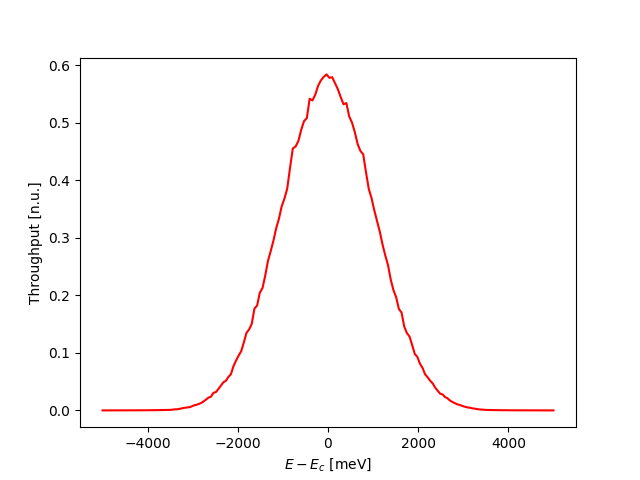
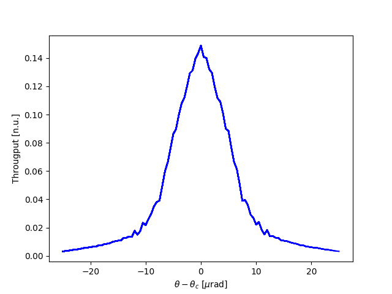
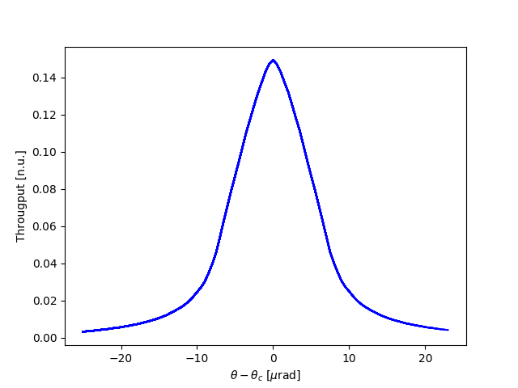

.. _throughput:

************
throughput
************

:author: Stanislav Stoupin
:email:  <sstoupin@gmail.com>

calculate throughput of a multicrystal configuration 
(dynamical theory of x-ray diffraction for perfect crystals)

SYNOPSIS
============

       throughput [options] func dpsi Ec dEx ne input_file

DESCRIPTION
============

A program to calculate throughput of a multicrystal configuration given by input_file using dynamical theory of
x-ray diffraction for perfect crystals
For a brief summary of options and parameters run::

    throughput -h

PARAMETERS
============

:func: angular divergence distribution function for incoming x-rays:
       
       ====  ============  ==================
       func  description   dpsi meaning
       ====  ============  ==================
       g     Gaussian      rms
       l     Lorentzian    fwhm
       f     flat          interval :math:`\pm` 3*dpsi
       1r    single ray    ignored
       ====  ============  ==================

:dpsi: angular divergence in units of [urad]
       
       * rms for Gaussian distribution
       * fwhm for Lorentzian distribution
       * interval :math:`\pm` 3*dpsi for flat 
       * any value (ignored) for single ray        

:Ec:   central  energy  for  energy  distribution  in  units of [keV] (corrected automatically depending on the
       choice of source and presence of crystals in backscattering configuration in the input file)

:dEx:    energy half-range in units of [meV]

:ne:     number of points in the energy grid (max 1000)

OPTIONS
============

:-v, --version:
       show version of program.

:-h, --help:
       show summary of options.

:-o FILENAME, --output FILENAME:
       write results to file (default to stdout)

:-w FILENAME, --write FILENAME:
       write data to file (default - no action)

:-p, --pi:
       :math:`\pi` polarization for incident wave (default - :math:`\sigma` polarization)

:-a NTH, --angular_scan NTH:
       perform crystal rotation (angular scan) with NTH points

:-s SRC, --source SRC:
       type of energy distribution for the source:
       
       ====    ===============================================
       SRC     description
       ====    ===============================================
       0       flat distribution (default)
       1       Cu K-alpha source
       9       energy distribution from file source_e.dat
       ====    ===============================================
       A point source is assumed. Source size is not included to the calculation at the moment.
       For throughput calculation the source size can be modeled as additional divergence. 

:-n NPSI, --npsi NPSI:
       number of points in the angular grid (default NPSI=200)

EXAMPLES
===========

1. Throughput (intensity as function of photon energy) of a multicrystal configuration (double-crystal diamond monochromator)

:download:`thru_hhlmC.in <../../examples/throughput/thru_hhlmC.in>`

.. literalinclude:: ../../examples/throughput/thru_hhlmC.in
   :language: guess
   :linenos:

To perform the calculation ::

       throughput g 5 23.7 5000 250 thru_hhlmC.in

2. Calculation of a rocking curve in a multicrystal configuration (the same double-crystal diamond monochromator, rocking curve of the 2nd crystal). 

:download:`c2rc_hhlmC.in <../../examples/throughput/c2rc_hhlmC.in>`

.. literalinclude:: ../../examples/throughput/c2rc_hhlmC.in
   :language: guess
   :linenos:

The code is not vectorized at present, calculations can take from a few minutes to a few hours.
The progress of the rocking curve calculation is displayed interactively (the plot is updated as each additional point is calculated).
Hint: prior to full simulation using divergent x-rays ("g", "l", or "f"), try quick estimation using single ray ("1r") ::

       throughput -a 100 -w c2rc_hhlmC_23keV.dat 1r 0 23.7 5000 250 c2rc_hhlmC.in

To perform the full calculation using divergent (Gaussian) beam ::

       throughput -a 100 -w c2rc_hhlmC_23keV.dat g 5 23.7 5000 250 c2rc_hhlmC.in
        

SEE ALSO
============

* :ref:`dtxrd`
* :ref:`rcpeak`

:author: Stanislav Stoupin
:email:  <sstoupin@gmail.com>
:date: |today|
